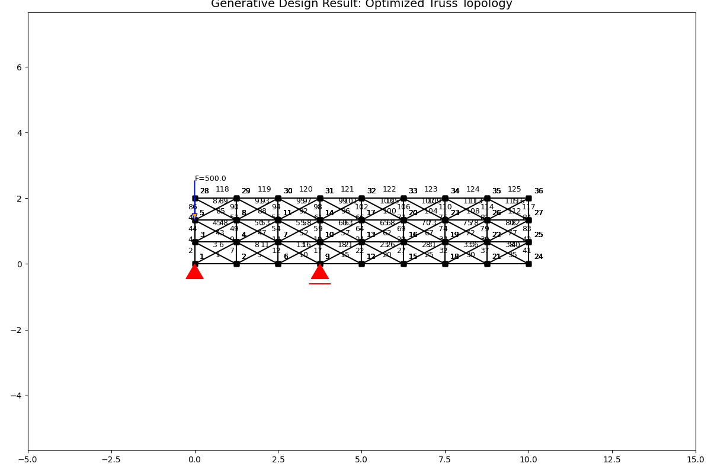
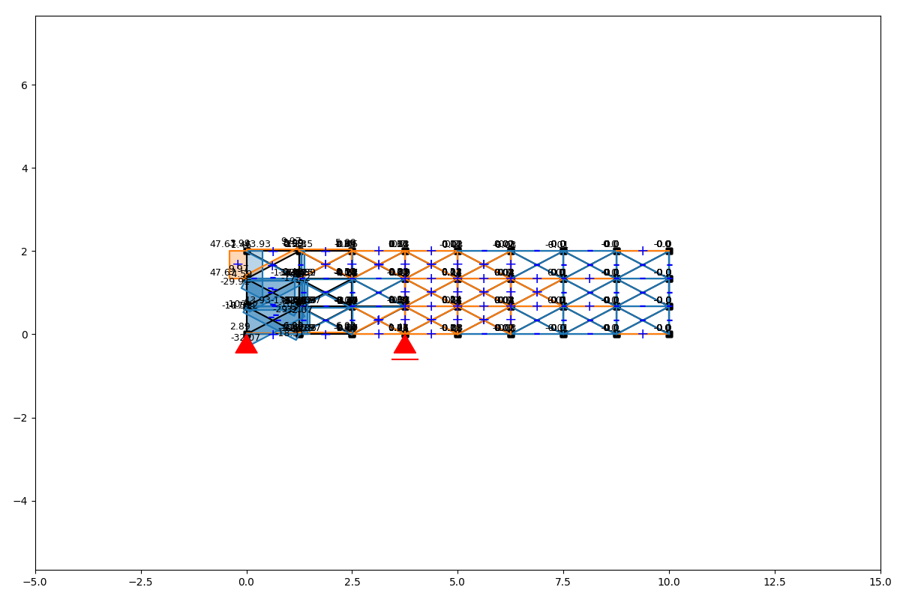

# 🧬 Generative Design: Topology Optimization

### 🎯 Overview
An evolutionary algorithm that autonomously "designs" the optimal shape of a bridge truss. Using principles of **Biomimicry** and **Strain Energy Minimization**, the algorithm evolves a chaotic grid into a highly efficient structure.

### ⚙️ Methodology
1.  **Ground Structure:** Starts with a fully connected continuum grid of potential structural members.
2.  **FEM Solver:** Solves the system using the Direct Stiffness Method (Python implementation).
3.  **Sensitivity Analysis:** Calculates the Strain Energy (Utility) of every member under load.
4.  **Natural Selection:** Iteratively removes the least efficient members (lowest energy contribution) while maintaining global stability.

### 📊 Results

*(Fig 1: The algorithm converged to a structure resembling a Warren Truss, reducing material usage by 60% while maintaining load-bearing capacity.)*

*(Fig 2: Axial force distribution showing efficient load paths (Blue: Tension, Orange: Compression).)*

### 🛠️ Tech Stack
* **Language:** Python
* **Physics Engine:** AnaStruct (FEM Library)
* **Logic:** Genetic/Evolutionary Algorithms

---
> ⚠️ **Note:** Source code is available upon request.
